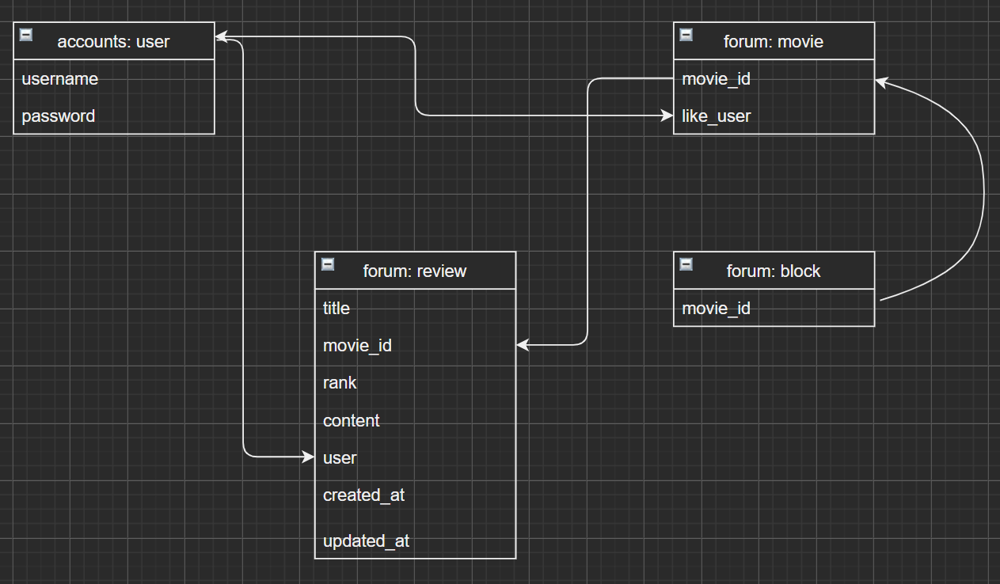

# http://simplemovie.link

배포 완료.


# PJT.README

**1. 조원 및 주요역할**

- 이세림: Vue, CSS
- 이현홍: Django - Vue Data

**2. 예정 추천 알고리즘**

- 사용자가 리스트에 넣어둔 내역을 바탕으로 불러온 영화들 중에서
  장르와 개봉일이 가깝고 평점이 높은 영화를 추천

**3. 커뮤니티**

- 커뮤니티는 별도의 창이 아니라, 검색한 영화에서 진입한다.
  해당 구현방식 이유는 사용자가 여론에 휘둘리는 것을 막고
  실제로 관심있는 영화에 대한 정보만 접근하도록 만드는 것이다.

# 방향

**필수 기능 구현도 우선시 하되, 매우 간단하고 사용 가능하도록 만든다.**

**모델 구성 및 알고리즘을 최우선으로 고민하고 우선 뼈대를 형성하기로 하였다.**

**기본적으로 수업중에 실습했던 내용을 중심으로 구현한 후, 시간이 남으면 별도로 구성해본다.**

**CSS는 간단한 정도만 동시에 진행하고, 되도록 나중에 해결한다.**





# 진행내용(한 일/할 일)

### 17

- Vue router를 기반으로 가능한 적은 이동으로 기능을 간단하게 구현할 수 있도록 구상
- 영화관 테마에 어울리도록 테마는 어둡게 하기로 하였다.
- 일단은 지난 실습처럼 TMDB API를 이용해 Vue 화면에 불러올 예정으로,
  장고는 계정 기능만 우선 구현하고, 커뮤니티나 영화 모델은 후에 만들기로 하였다.

### 18

- Django와 Vue에 jwt토큰을 사용하여 회원기능을 구현.
  Vue와 Django 데이터 연동 기본 작성하여 포럼 생성 및 리뷰 생성 기능 완성

### 19-21

- 포럼 작동방식이 영화 상세정보를 통해 해당 영화 포럼으로 연결되므로, 한 페이지에 표시된 리뷰는
  모두 한 영화에 대한 글이다. 때문에 리뷰와 댓글 기능을 함께 구현하지 않고 내용이 바로 표시되도록 하여
  오픈 포럼 느낌으로 글이 달리도록 변경하였다.


- 받아온 유저가 pk로 표시되고, 다른 곳에서도 username과 userid를 사용하는 경우가 있으므로
  {pk: username, is_superuser} 받아와서 usercode로 저장

- navbar 이름이 바뀌지 않는 현상 발생 -> 새로고침 함수를 생성함

```javascript
// Login.vue
 this.$router.go()
```


- Add My List와 Remove On List 버튼을 토글시킨다.

```javascript
1 in [1]		//false
1 == [1]		//true
1 in [-1, 0]	//true
```

- Javascript를 Python처럼 쓰려다 자꾸만 오류가 났다.
  ~~movie의 like_user 모델에 'dummy1' 'dummy2'를 추가시켰다.
  우선 배열로 제대로 인식시키기 위해 더미데이터를 집어넣었고,~~
  javascript의 in 연산자는 인덱스, 수, 값 중 하나라도 만족하면 true를 반환하기 때문에
  공식문서를 통해 include 함수를 사용해야함을 깨달았다.

- Django에서 None을 불러오면 include과정에서 문제가 생겨 [] 공백 리스트를 기본 반환하도록 구현
  
- ### 추천알고리즘 구상

  1. 같은 영화를 좋아하는 사람이 리스트에 넣어둔 영화 중에서 내 리스트에 없는 영화
  2. TMDB 추천 및 비슷한 영화

- 로고 디자인 변경

  

### 22

- 추천 알고리즘 구현
  - 계획: 같은 영화를 리스트에 넣은 다른 사용자의 리스트 목록 추천
  - 구현: TMDB recommendations와 similar 사용
  
- Random 추천 탭 구성을 위한 vuex actions에서 dispatch를 통한 재귀 함수 구현
  +성인 영화가 표출되는 문제가 발생하여 adult 속성이 true인 경우 버튼을 눌러야 포스터가
  출력되도록 수정
  
- My Movie List에서 ~~Detail키를 누르면 Modal 방식으로~~ 영화상세정보가 표시되도록 기능 추가
  → v-for로 모달에 옵션을 넘기면 모든 버튼이 같은 데이터를 갖는 문제 발생
  → 기존처럼 detail 페이지로 이동하도록 변경
  
- navbar의 두께를 줄이면 웹 반응중에 상단 메뉴 틀이 움직이는 현상 발생
  → fixed-top 기능으로 막았으나, offcanvas 공간을 클릭할 수 없는 현상이 발생함
  → 우선 두께를 얇게 하는 것을 포기하고 정상화시킴
  
- Query Set - serializer many=True 반드시 확인

  

### 23

- Block 구현
  vuex state에 blockcodes를 만듦
  Django에 차단 목록을 구성하고,  movie_pk 검사해서 채가도록 설정
  매번 검증해줘야 하는 불편함 존재
  DB 미구현의 단점
  → 링크로만 들어가게 해뒀는데 netlify로 보냈더니 링크 진입이 안 됨..???
- vue-card-carousel을 사용하려고 했으나, cpu 자원을 심하게 잡아먹고 데이터가 많아서 포기
  홈페이지 상단 CSS 꾸밀 때 고려

### 24

- 검색 기능 구현 예정
  검색할 때 자동으로 스크롤을 내려 사용자 경험 증가
- CSS
  - Home 상단에 dailyhot carousel 추가
    →card 디자인으로 구상했던 슬라이더들 전부 vue carousel로 변경 예정
  - height 설정으로 외부 스크롤바를 없애고 전부 커스텀 스크롤바 사용
    →스크롤 이동 window에서 개체로 변경, id  사용 및 호출로 해결
    →move Top 이동 버튼 문제 발생 
    → 가로 탭 비중이 높아 사용성이 높지 않을 것으로 판단되어 제거 결정
  - 기존 more 진입 영화 카드 재단장
    →버튼 통일성 부여 및 카드 형태 재정비
    →모바일 화면에서 @dblclick 작동 안 함
    →모바일 화면을 우선하므로 @click으로 설정
    →조작감 통일을 위해 클릭 이벤트 제거
  - 홈페이지 디자인
    →로고 폐기
- Profile 기능 구현
  - my list 관리 및 작성 리뷰 확인
  - 탈퇴 기능 추가

### 25

- CSS
- signup validation
  - ID: 알파벳 및 숫자
  - PW: 숫자, 알파벳,  특수문자(!@#$%^&*)를 각 하나씩 포함
- 배경음악 추가
  - 소리 조절 0.1
- 배포 해보기
  - https://simplemovie.link
- 모바일 최적화로 만들었는데 모바일에서 깨진다.😥

